<p align="center">
  <picture>
    <source media="(prefers-color-scheme: dark)" srcset="docs/images/logo-dark.png">
    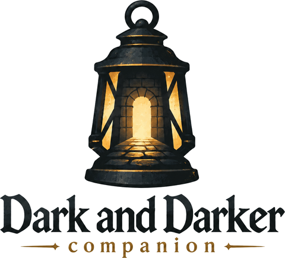
  </picture>
</p>

<p align="center">
  <b>The free AI market tool for Dark and Darker.</b><br>
  Know what every item is really worth, list it at the right price, and collect your gold. Everything runs on your PC.
</p>

<p align="center">
  <a href="https://github.com/Davidmycodeguy/dad-companion/releases/latest"><b>Download for Windows</b></a>
  &nbsp;·&nbsp;
  <a href="https://davidmycodeguy.github.io/dad-companion/"><b>Watch the video</b></a>
</p>

<p align="center">
  <a href="https://davidmycodeguy.github.io/dad-companion/#video">
    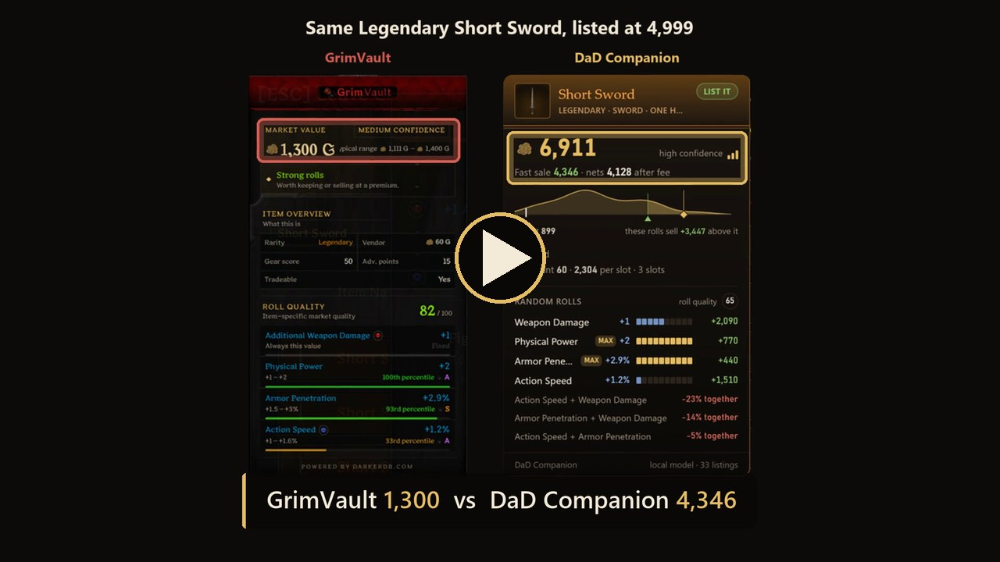
  </a>
</p>

## Why use it

- **Hover any item** in the stash, the Marketplace or a merchant and see what it really sells for,
  a fast-sale price and exactly what you keep after the listing fee.
- **AI trained on the market.** It learns what every stat is worth in gold, and which stats are
  worth more together (on Legendary Heavy Gauntlets, Physical Power with Strength sells for about
  17% more as a pair).
- **Stop underpricing your best rolls.** The card shows how far above the cheapest listing your
  rolls sell.
- **Auto lister, gold collection, stash sorter and quest tracker** in the same app.
- **Free, no subscription, no account.** Your data never leaves your PC.

## Download and launch

1. Open the [latest release](https://github.com/Davidmycodeguy/dad-companion/releases/latest) and
   download **`DaD.Companion_x.y.z_x64-setup.exe`**.
2. Run it. Windows may say *"Windows protected your PC"* because the installer isn't code-signed
   yet: click **More info**, then **Run anyway**.
3. Install [Npcap](https://npcap.com/#download) (free) if you don't have it. It lets the app read
   the game's traffic, so your stash, listings and quests update as you play. The app tells you if
   it's missing.
4. Start Dark and Darker, then **DaD Companion** from the Start menu.

That's it: the app comes with market data (about 115,000 listings) and a trained price model, so
hover values work from the first start. To refresh prices, open Trade → Marketplace → My Listings in game
and press **Update** (or **Deep crawl**) on the Auto lister page. New versions install themselves when you
accept the update prompt.

Windows 10 or 11 (64-bit). If you used DnDTools, its market history, characters and quest progress
are imported on the first start.

## How the AI prices an item

The app reads the Marketplace listing by listing into a database on your PC, then trains its price
model locally in a few seconds. For every item it learns what each random roll adds or takes away
in gold, and how pairs of rolls change the price together. That's what the value card shows:

<p align="center">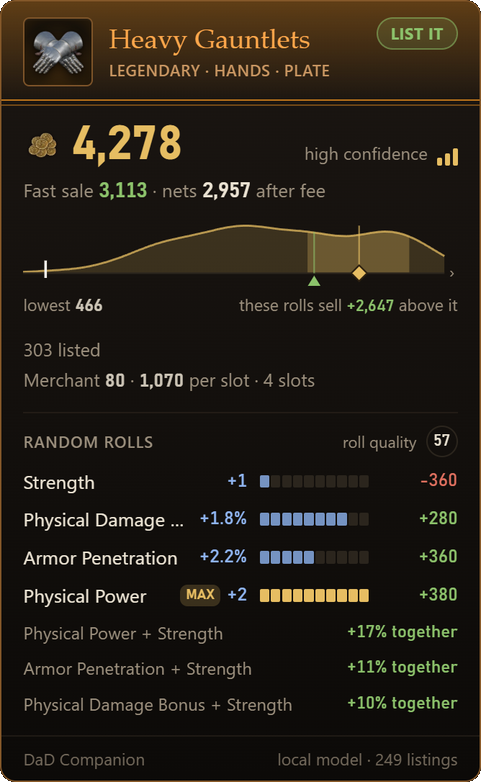</p>

- **Value and fast sale:** what these exact rolls are worth, and a price that sells quickly.
- **Nets after fee:** what lands in your pocket once the game's listing fee is paid.
- **The curve:** where this item sits among live listings, and how far above the cheapest one
  these rolls sell.
- **Random rolls:** gold per roll, and pairs that sell for more (or less) together.

## One example: DaD Companion vs GrimVault

Same Legendary Short Sword, hovered with both tools on 28 September 2026. GrimVault's free Market
Value said **1,300 gold**. DaD Companion priced the rolls and said **4,346** for a fast sale.
Legendary Short Swords with similar rolls were listed at 4,222 to 8,888 that day, so selling at
1,300 would have left about 3,000 gold on the table.

<p align="center">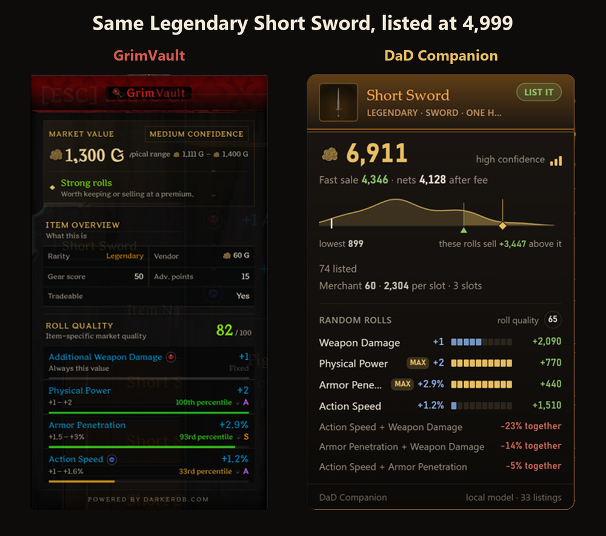</p>

This is one measured example, not a promise about every item: prices move, and both tools are
estimates.

## Features

### Market research

Look up any item (Ctrl+K anywhere) and see its whole market: every rarity with how many are
listed, the lowest and median ask, how prices spread and move day to day, recent sales, and every
open listing with its rolls. The Market page opens on what is listed most and what sold fastest
this week.

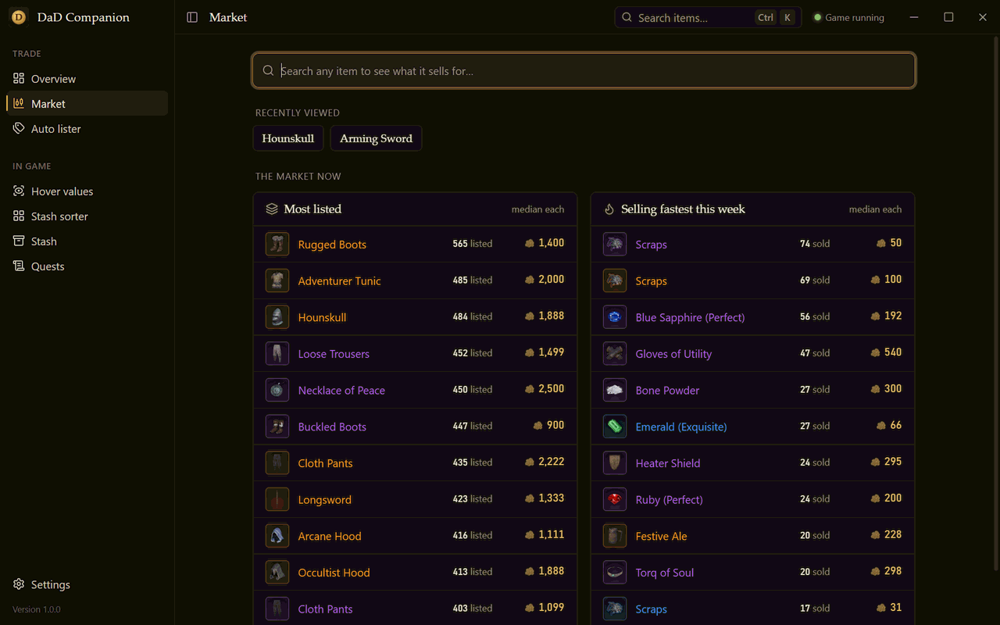

### Hover values

Rest the cursor on an item in game (stash, market, merchants, in the dungeon) and a card appears
beside the tooltip about a quarter of a second later: what that exact item sells for, a fast-sale
price and what it nets after the fee, how its rolls add or take value, and whether to list it or
sell it to a merchant.

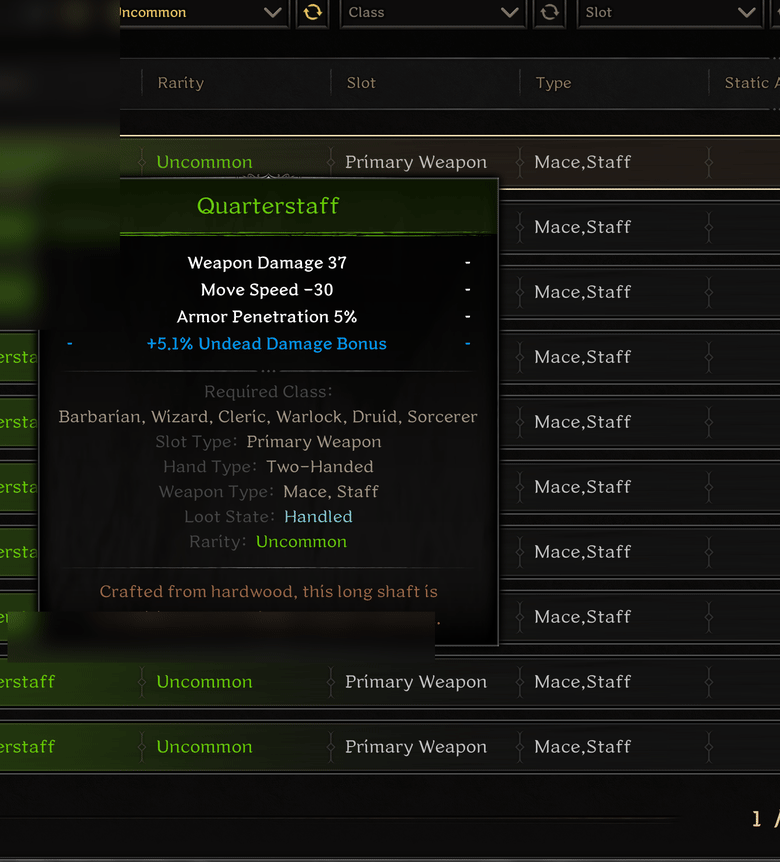

### Auto lister

Pick the stash tabs and rules, and the lister prices every item from live market searches, your
saved market data or the AI model. You review the plan first: prices you can change, the fees,
what you get if everything sells, and why anything was left out. Listing always asks first,
because the game never refunds fees. It can also re-check each price right before listing,
collect your sold gold, keep the market data fresh and sell leftovers to a merchant.

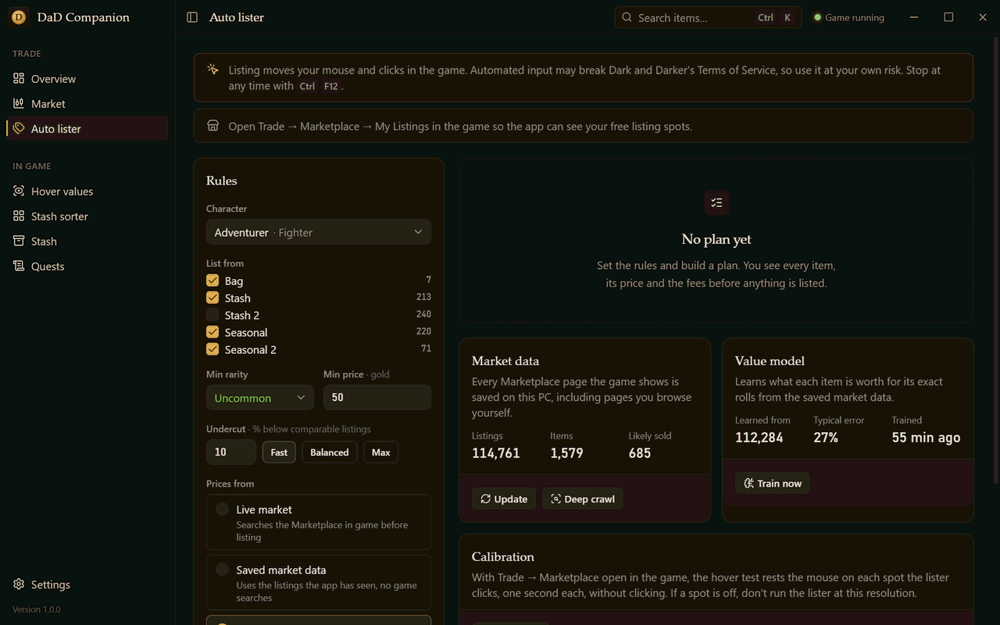

A real run: each item is priced from a live market search, then listed.

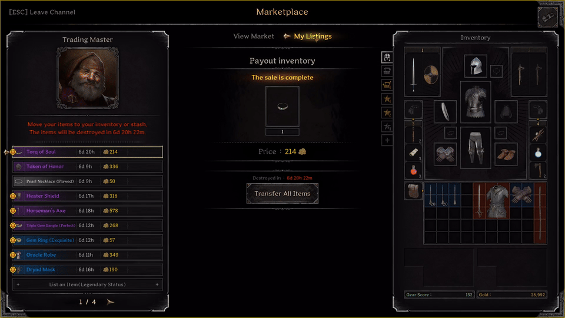

Collecting the gold of sold listings:

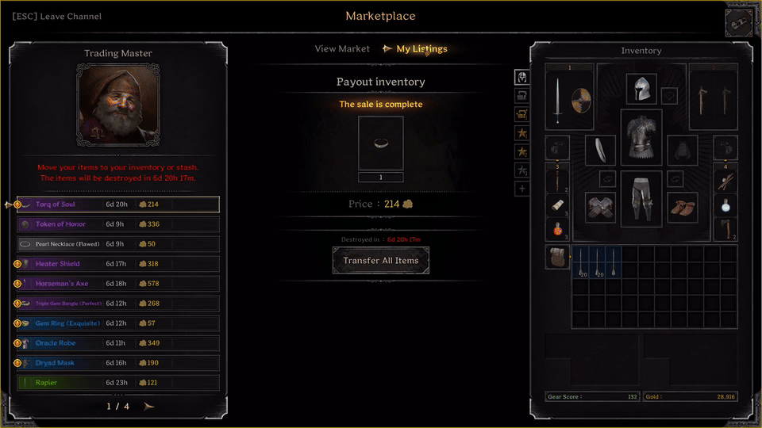

### Stash sorter

See a stash tab as it is and as it will be, set the sort order, and let the sorter move everything
into place, checking every move on screen. A tab that is already sorted needs no moves.

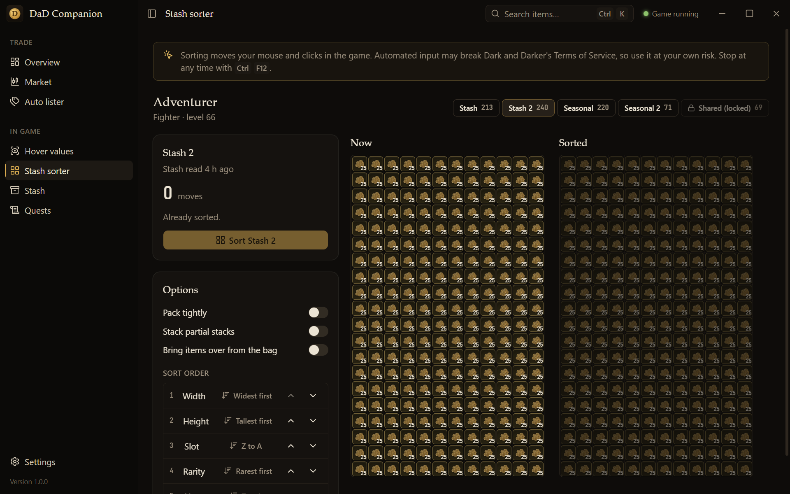

### Stash and quests

Every stash tab laid out like the game's grid, with gold and what each item is worth. Merchant
quests in chain order, what each objective still needs, and a checklist of items to keep.

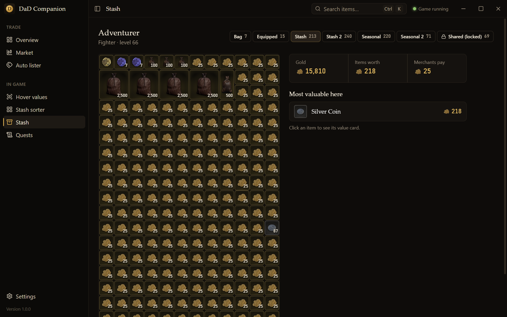

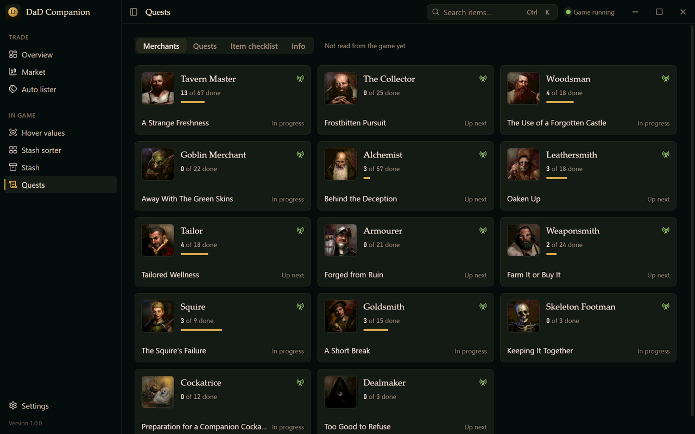

## Good to know

- **Privacy:** no accounts, no telemetry, no uploads. The only network request the app makes is
  checking this repository for updates.
- **Stopping:** anything that moves the mouse (listing, selling, sorting) stops with Ctrl+F12, the
  Stop button, or when you move the mouse or switch away from the game.
- **The locked Seasonal Shared Stash** is never listed from, sold from or sorted.
- **Use at your own risk:** automating game input may break Dark and Darker's Terms of Service.

## Build and edit the code

You need Windows 10 or 11 and:

- [Rust](https://rustup.rs/) (stable) with the Visual Studio C++ build tools that rustup offers to install
- [Node.js 22](https://nodejs.org/) and [pnpm](https://pnpm.io/installation) 10
- WebView2 (already on Windows 11) and [Npcap](https://npcap.com/#download) for live game data

Run the app in development mode, with hot reload for the UI:

```bash
git clone https://github.com/Davidmycodeguy/dad-companion.git
cd dad-companion/app
pnpm install
pnpm tauri dev
```

Run the tests (the Rust side embeds the built UI, so build it once first):

```bash
cd app && pnpm build && pnpm test && cd ..
cargo test --workspace
```

Where things are:

| Folder | What's in it |
|---|---|
| `app/src` | The React + TypeScript interface (pages, components, the value card) |
| `app/src-tauri` | The Tauri shell: commands the UI calls, the overlay window, updates |
| `crates/` | The engine in Rust: packet capture and parsing, market history, the price model, lister, sorter, quests |
| `assets/` | Game data, icons and the starter market data shipped with the installer |
| `docs/` | Architecture notes, README images and the project website |

See [docs/ARCHITECTURE.md](docs/ARCHITECTURE.md) for how the pieces fit together. Releases are
built by GitHub Actions when a version tag is pushed.

## Contributing

Pull requests and bug reports are welcome:

1. Fork the repository and create a branch.
2. Make your change, with tests where it makes sense, and run the checks above.
3. Open a pull request describing what changed and why.

By contributing you agree to the contribution terms in the [license](LICENSE).

## License

**Source-available, all rights reserved.** You may use the official releases for personal use,
read the code, and send issues and pull requests. You may not copy, reuse or redistribute the code
or builds of it. See [LICENSE](LICENSE) for the full terms.

Dark and Darker is a trademark of IRONMACE. This project is not affiliated with or endorsed by
IRONMACE.
